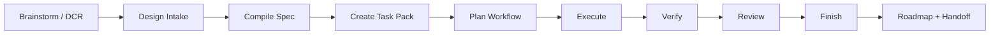

# AgentSpec

AgentSpec turns design intent into durable, repo-local operating context for
human + agent software delivery.

It is a local-first CLI that snapshots sources, derives requirements, creates
bounded task packs, runs governed execution loops, records verification/review
evidence, and writes back roadmap + handoff state. The goal is simple: a code
agent should be able to continue work from the repository itself, not from chat
history.

## Why It Exists

Code agents work best when the operating contract is explicit:

- what source material is canonical
- which requirements are accepted
- what paths a task may touch
- what verification and review evidence is required
- what should be handed to the next human or agent

In a target project, AgentSpec keeps that contract in repo-local artifacts such
as `docs/source/`, `docs/traceability/requirements.yml`,
`agent/context-packs/`, `agent/task-ledger.yml`, `agent/handoff.yml`, and
`docs/ROADMAP.md`.

This distribution repository intentionally does not publish its own dogfood
AgentSpec state. Public clones contain the CLI, tests, human-facing docs, and
the Codex/Claude plugin packages; generated `agent/`, `reports/`, `.codex/`,
`.claude/`, `.agentspec/`, design, plan, traceability, and source snapshot
artifacts stay local.

This README is the front door. The deeper human guide is
[docs/GETTING_STARTED.md](docs/GETTING_STARTED.md).

## Install

Install the CLI from a checkout while developing:

```bash
pip install -e .
```

Or install from GitHub:

```bash
pip install "git+https://github.com/yimwoo/agent-spec-engine.git"
```

Both expose `aspec` and `agentspec` on `PATH`. They are the same CLI. If you do
not want to install the package, use:

```bash
python -m agentspec.cli --help
```

## Code Agent Plugins

The Codex and Claude Code plugin packages are in `agentspec-codex-plugin/` and
`agentspec-claude-plugin/`.

Load or install the plugin directory itself, not the repository root. Each
plugin package contains only its manifest, README, and `skills/` files. It does
not ship this repository's private `agent/`, `docs/source/`, `reports/`,
`.codex/`, `.claude/`, or `.agentspec/` state.

After installing or loading a plugin, the normal human interface is a prompt to
the code agent. The agent runs `aspec`, reads the target repository's
AgentSpec artifacts, and reports evidence back.

## Prompt-First Quickstart

Most humans should not need to manually drive every lifecycle command. Install
the plugin or make the CLI available, then ask your code agent to use AgentSpec.

For a new project:

```text
Use AgentSpec to initialize this repository. The design source is at
docs/source/design.md. Set up Codex and Claude agent guidance, compile the
requirements, report readiness/open questions, and propose the first task
context packs. Do not start implementation until the task scope and allowed
paths are clear.
```

For an existing AgentSpec project:

```text
Use AgentSpec to continue this repository. Read AGENTS.md, run project status,
pick the next ready task pack, follow its allowed paths, run verification,
record review evidence, finish the task, and refresh roadmap/handoff state.
```

For a new design or design change:

```text
Use AgentSpec to process this design update: <path-or-export>. Import it as a
candidate or DCR, diff it against the accepted source, summarize the impact,
and prepare the next task pack. Ask before promoting accepted source or
expanding implementation scope.
```

The agent should report back with the requirement IDs, task pack path, allowed
paths, verification commands/results, review ID, and updated handoff/roadmap
status.

## Agent-Operated CLI Flow

These are the commands a code agent or automation typically runs after the
prompt above. They remain useful for advanced manual operation.

```bash
aspec init --mode greenfield --targets claude,codex
aspec ingest docs/source/design.md
aspec compile
aspec status
aspec task create --requirement R-001
aspec plan --current
aspec run loop
```

After implementation work, record review and finish write-back:

```bash
aspec review code --task T-001 --verdict ready --summary "No blocking findings."
aspec finish T-001 --test-status passed --review REVIEW-0001
aspec roadmap --check
```

For this repository, use `PYTHONPATH=$PWD aspec ...` if the editable install is
not active in your shell.

## Lifecycle

AgentSpec's native lifecycle is the project contract. Plugins and local skills
are adapters over these repo-local artifacts, not separate sources of truth.



Core commands:

| Stage | Command |
|---|---|
| Status | `aspec status --json` |
| Lifecycle map | `aspec lifecycle` |
| Source intake | `aspec ingest`, `aspec intake import`, `aspec compile` |
| Task planning | `aspec task create`, `aspec plan` |
| Execution | `aspec run loop`, `aspec run step`, `aspec run package`, `aspec run result` |
| Verification | `aspec outcome`, `aspec maturity status`, `aspec roadmap --check` |
| Review | `aspec review code` |
| Finish | `aspec finish`, `aspec task complete` |
| Recovery | `aspec next-action`, `aspec continue` |

The lifecycle surface is part of the CLI contract. Plugins and emitted local
agent guidance should call these commands rather than maintaining a parallel
state store.

## Project Model

AgentSpec separates incoming design material from accepted repo-local truth:

- **Source snapshot**: immutable source material under `docs/source/`.
- **Requirement**: accepted implementation obligation in
  `docs/traceability/requirements.yml`.
- **DCR**: design change request for anything that changes after the accepted
  source snapshot.
- **Task context pack**: bounded implementation unit under
  `agent/context-packs/`.
- **Workflow**: native execution plan under `agent/workflows/`.
- **Review + finish evidence**: records under `agent/reviews/`,
  `agent/task-ledger.yml`, `agent/handoff.yml`, and `docs/ROADMAP.md`.

In a target project, agents should start from `AGENTS.md`,
`aspec status --json`, and the active task pack. Humans should start from this
README and [docs/GETTING_STARTED.md](docs/GETTING_STARTED.md).

## Repository Layout

```text
agentspec/                  CLI implementation
tests/                      regression tests
docs/GETTING_STARTED.md     human guide for using AgentSpec
agentspec-codex-plugin/     Codex adapter package
agentspec-claude-plugin/    Claude adapter package
```

Generated AgentSpec artifacts such as `agent/`, `reports/`, `.codex/`,
`.claude/`, `.agentspec/`, `docs/source/`, `docs/spec/`,
`docs/traceability/`, `docs/change-requests/`, `docs/designs/`,
`docs/discovery/`, and `docs/plans/` are intentionally ignored in this
distribution repository. They are created and committed in the target
repositories that choose to use AgentSpec governance.

## Human Guide

Read [docs/GETTING_STARTED.md](docs/GETTING_STARTED.md) for:

- bootstrapping a new project
- importing changing external sources
- creating and executing task packs
- recording verification and review evidence
- finishing work and refreshing handoff/roadmap state
- deciding what to commit

## Verification

```bash
python -m unittest discover -s tests -v
python -m pip wheel . --no-deps --wheel-dir /tmp/agentspec-wheel-check
python -m build --sdist --outdir /tmp/agentspec-sdist-check
git diff --check
```
