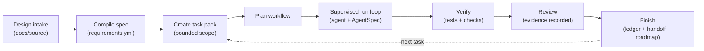

# AgentSpec

> **A persistent, repo-local operating contract that guides AI coding agents — Codex, Claude Code, and more — across the whole software lifecycle: design → planning → supervised execution → verification → review → handoff.**

[](https://github.com/yimwoo/agent-spec/releases)
[](pyproject.toml)
[](LICENSE)

AgentSpec turns your design docs into a **governed, file-based operating
contract** for AI coding agents. The contract lives in your repo — accepted
requirements, scoped tasks, allowed file paths, iteration limits, verification
commands, and review evidence — all version-controlled. **No external service
or database is required.**

Unlike a passive control plane, AgentSpec **actively guides the agent at every
step**: it packages the next instruction, the allowed paths, the iteration
budget, and the verification expectations, hands them to Codex or Claude Code,
then validates what came back before deciding what to do next. You can stop a
project mid-flight, come back days later, and continue from the repo — not
from chat history.

```text
   Design doc  →  Accepted spec  →  Scoped task pack  ──┐
                                                        │
                                ┌───────────────────────┘
                                ▼
              Supervised run loop  (per step: prompt + allowed paths + budget)
                                │
                                ▼
                    Verify  →  Review  →  Handoff
                    (all evidence written back to the repo)
```

---

## Why AgentSpec

AI coding agents are powerful, but the day-to-day pain is familiar:

- **Context evaporates** — every session you re-paste the design, the conventions, the "don't touch that folder" rules.
- **Scope creep** — the agent helpfully refactors a file you didn't ask it to.
- **No paper trail** — you can't tell whether tests actually ran, what was reviewed, or what the next person should pick up.
- **Drift** — the design doc says one thing, the code does another, and nobody notices until production.

AgentSpec fixes this by keeping the operating contract — *what is canonical,
what is in scope, what counts as verified, how many iterations remain* —
**in the repository itself**, and re-asserting it on every step. A new agent
(or a new teammate) can resume work without reading chat history.

---

## Quick start

### 1. Install the CLI

Stable release (recommended):

```bash
pip install "git+https://github.com/yimwoo/agent-spec.git@v0.1.24"
```

Latest from main (dev):

```bash
pip install "git+https://github.com/yimwoo/agent-spec.git@main"
```

Requires Python 3.11+. Installs `aspec` and `agentspec` as console scripts.
Verify:

```bash
aspec --help
```

### 2. Install the plugin for your agent

The plugin teaches Codex or Claude Code how to call AgentSpec safely. The
`aspec` CLI is still the source of truth — the plugin is a thin adapter that
turns natural-language requests into `aspec` invocations.

<details>
<summary><b>Codex</b></summary>

```bash
# Current installer. Clones/updates the Codex plugin source from main.
curl -fsSL https://raw.githubusercontent.com/yimwoo/agent-spec/main/install.sh | bash
```

> Release-pinned plugin installation is planned; today the installer tracks
> `main`. Pin the CLI separately with `@v0.1.24` (see step 1).

Then enable the plugin:

```text
codex
/plugins
```

Choose the local marketplace, open `aspec`, select **Install plugin**. In the
Codex desktop app, restart and enable `aspec` under **Plugins > Local Plugins**.
</details>

<details>
<summary><b>Claude Code</b></summary>

```text
/plugin marketplace add yimwoo/agent-spec
/plugin install aspec@agentspec
```
</details>

### 3. Ask the agent to drive AgentSpec

Open your repository, then prompt your agent.

**Bootstrap a new project:**

> Use AgentSpec to initialize this repository. The design source is at
> `docs/source/design.md`. Set up Codex and Claude agent guidance, compile the
> requirements, report readiness and open questions, and propose the first
> task context packs.

**Continue an existing project:**

> Use AgentSpec to continue this repository. Read `AGENTS.md`, run project
> status, pick the next ready task pack, run the supervised execution loop,
> record review evidence, finish the task, and refresh roadmap + handoff.

Behind the scenes, the agent runs a CLI sequence like:

```text
aspec init  →  aspec ingest  →  aspec compile  →  aspec task create
            →  aspec plan    →  aspec run loop  ──► (agent executes)
            →  run the task pack's verification commands
            →  aspec review code  →  aspec finish
```

The agent reports back: requirement IDs touched, task pack path, allowed paths,
iteration count, verification commands and results, review ID, and updated
handoff/roadmap state.

---

## The operating contract: how AgentSpec guides execution

AgentSpec is more than a wrapper around `before` and `after`. During a task,
it runs a **supervised loop** — `aspec run loop` orchestrates step-by-step
execution, and at every step it hands the agent a fresh contract:

1. **A runner package** (`aspec run package`) containing the next executor
   prompt, the active context pack, the iteration counter (e.g. *3 of 5*),
   allowed and forbidden paths, and the expected result schema. The agent
   reads this — not free-form chat — to know what to do next.
2. **The agent executes one step**, then submits structured results back via
   `aspec run result`.
3. **AgentSpec validates** the result against policy: touched paths against
   the allowlist, iteration count against `max_iterations`, destructive git
   operations, credential leakage, missing tests.
4. **AgentSpec decides** whether to continue (next runner package), halt
   (budget exhausted, policy violation), or hand off for review.

What the agent receives in a **task context pack** is itself a contract:

- **Goal** — the requirement the task implements.
- **Requirements** — linked `R-###` IDs with priority and confidence.
- **Source sections** — the design snippets that justify scope.
- **Allowed paths** — whitelist of files the task may edit, each marked `confirmed` or `inferred`.
- **Forbidden paths** — explicit boundaries.
- **Tests to add or update** — verification targets.
- **Acceptance criteria** — definition of done.

The result: scope creep is caught at the next step boundary, not after the
PR is filed. Iteration limits prevent runaway loops. Verification is
required before finish. The contract survives session boundaries because
it lives in the repo, not in the model's context window.

---

## Lifecycle



AgentSpec defines **10 native lifecycle stages**: brainstorm, design, plan,
branch start, **execute**, delegate, verify, review, branch finish, and
handoff recovery. Every stage writes evidence back to the repo. Interrupted?
The next session reads `agent/handoff.yml` and `agent/runs/` and continues
from the right step.

For the full **control-plane and execution architecture** — adapter → CLI →
source/spec → planning → supervised run → governance — see
[docs/GETTING_STARTED.md#how-the-pieces-fit](docs/GETTING_STARTED.md#how-the-pieces-fit).

---

## Files added to target repositories

Plugin install does **not** touch your project. Files appear only after
`aspec init` + `aspec emit`, which create `AGENTS.md`, `CLAUDE.md`,
`.agentspec/`, `agent/` (context packs, workflows, runs, reviews, ledger,
handoff), `docs/` (source, spec, traceability, ADRs, DCRs, ROADMAP), and
`reports/`. See the full tree in
[docs/GETTING_STARTED.md#files-added-to-target-repositories](docs/GETTING_STARTED.md#files-added-to-target-repositories).

---

## Core concepts

The key terms — source snapshot, requirement, DCR, task context pack,
workflow, runner package, supervised run, handoff, review evidence — are
defined in the glossary at
[docs/GETTING_STARTED.md#mental-model](docs/GETTING_STARTED.md#mental-model).

---

## What AgentSpec does *not* do

AgentSpec is a contract and a harness, not a guarantee. Out of scope:

- **It does not replace code review.** It records review evidence and gates finish on it; humans (or other agents) still judge correctness.
- **It does not guarantee correctness.** Verification gates run the tests you define — they don't know what you forgot to test.
- **It does not sandbox the agent at the OS level.** Allowed-path policies are *enforced at each step boundary* (touched paths are validated and a runaway agent will be halted), but AgentSpec cannot prevent the agent process from writing to a forbidden path between steps. Pair it with OS-level sandboxing if you need hard isolation.
- **It does not host project data.** All state lives in your repo's files. No external service, account, or database is required or used.

### Security and data handling

AgentSpec stores all state in repo-local files. Treat imported design docs,
candidate snapshots, and task packs as **untrusted content** (the pack
template explicitly marks design excerpts `UNTRUSTED SOURCE CONTENT`). Agents
should operate within `AGENTS.md`, allowed paths, and review gates. Review
DCRs and external imports before promoting them to accepted source.

---

## Docs and further reading

- **[docs/GETTING_STARTED.md](docs/GETTING_STARTED.md)** — full human guide:
  exact CLI sequences, control-plane and execution architecture, importing
  changing sources, supervised run workflows, recovery commands.
- **[agentspec/](agentspec/)** — CLI source: `run.py` (supervised loop),
  `runner.py` (runner packages), `policy.py` (path + iteration gates),
  `task.py` (context pack rendering), `lifecycle.py` (10 native stages).
- **[agentspec-codex-plugin/](agentspec-codex-plugin/)** — Codex adapter.
- **[agentspec-claude-plugin/](agentspec-claude-plugin/)** — Claude Code adapter.

---

## Contributing / Development

```bash
git clone https://github.com/yimwoo/agent-spec.git
cd agent-spec
pip install -e .
python -m unittest discover -s tests -v
```

Or run the CLI without installing console scripts:

```bash
python -m agentspec.cli --help
```

---

## License

AgentSpec is released under the MIT License. See [LICENSE](LICENSE) for the
full license text.

---

**Keywords:** AI coding agent · spec-driven development · agent operating contract · agent execution harness · Codex plugin · Claude Code plugin · agent governance · repo-local memory · supervised AI agent · iteration-bounded agent · LLM development workflow · AI pair programming · agent control plane
