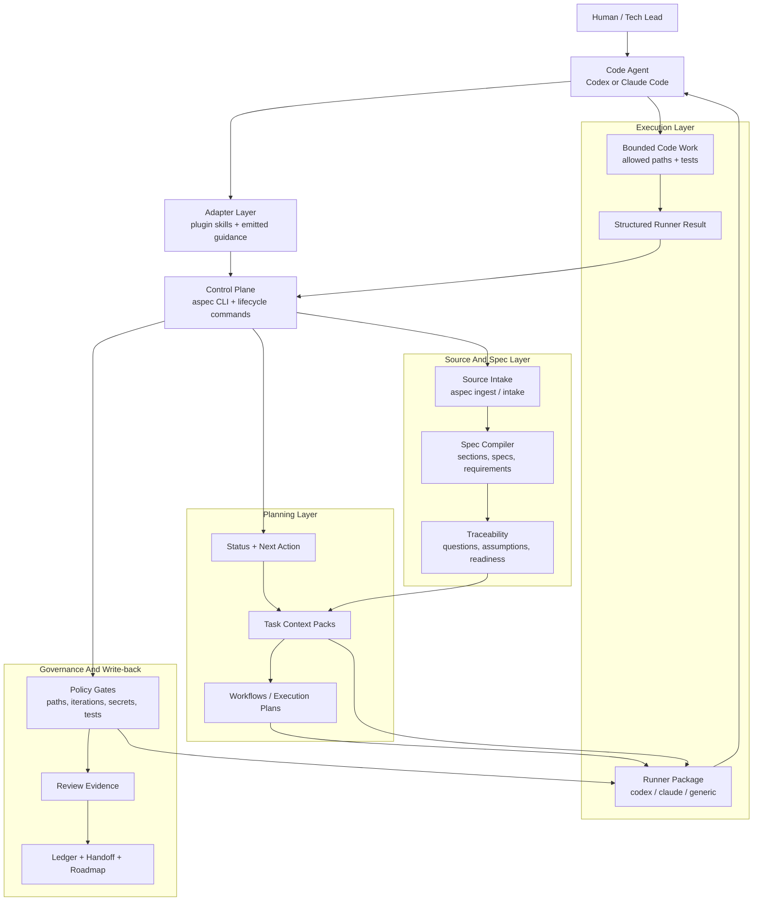
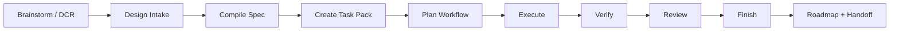

# AgentSpec

**Repo-local product memory and task governance for Codex and Claude Code.**

[](https://github.com/yimwoo/agent-spec-engine/releases)
[](pyproject.toml)

AgentSpec turns design intent into durable, repo-local operating context for
human + agent software delivery. It snapshots sources, derives accepted
requirements, creates bounded task packs, runs governed execution loops,
records verification/review evidence, and writes back roadmap + handoff state.

The goal is simple: a code agent should be able to continue work from the
repository itself, not from chat history.

## Quick Start

Install the code-agent plugin first. The plugin teaches Codex or Claude Code
how to use AgentSpec safely; the `aspec` CLI remains the source of truth.

### 1. Install A Plugin

**Codex**

```bash
curl -fsSL https://raw.githubusercontent.com/yimwoo/agent-spec-engine/main/install.sh | bash
```

Then install or enable `aspec` in the Codex surface you use:

```text
# Codex CLI
codex
/plugins
```

In the CLI plugin browser, choose the local marketplace, open `aspec`, and
select `Install plugin` or toggle it on. In the Codex app, restart Codex, open
**Plugins > Local Plugins**, and install `aspec`.

After installation, open the target repository you want AgentSpec to manage.

**Claude Code**

Inside Claude Code:

```text
/plugin marketplace add yimwoo/agent-spec-engine
/plugin install aspec@agentspec
```

### 2. Install The CLI

The plugins call the CLI, so make `aspec` available on `PATH`:

```bash
python3 -m pip install "git+https://github.com/yimwoo/agent-spec-engine.git"
```

For development from this checkout:

```bash
pip install -e .
```

Both commands expose `aspec` and `agentspec`. If you do not want shell entry
points, use:

```bash
python3 -m agentspec.cli --help
```

### 3. Ask The Agent

For a new project:

```text
Use AgentSpec to initialize this repository. The design source is at
docs/source/design.md. Set up Codex and Claude agent guidance, compile the
requirements, report readiness/open questions, and propose the first task
context packs. Do not start implementation until the task scope and allowed
paths are clear.
```

For an existing AgentSpec project:

```text
Use AgentSpec to continue this repository. Read AGENTS.md, run project status,
pick the next ready task pack, follow its allowed paths, run verification,
record review evidence, finish the task, and refresh roadmap/handoff state.
```

For a new design or design change:

```text
Use AgentSpec to process this design update: <path-or-export>. Import it as a
candidate or DCR, diff it against the accepted source, summarize the impact,
and prepare the next task pack. Ask before promoting accepted source or
expanding implementation scope.
```

The agent should report requirement IDs, the task pack path, allowed paths,
verification commands/results, review ID, and updated handoff/roadmap status.

## What AgentSpec Creates

Plugin installation does not copy this repository's private dogfood state into
your project. A target repository receives AgentSpec files only after you ask
the agent to initialize or continue that repository.

After `aspec init --mode greenfield --targets claude,codex` and
`aspec emit --target claude,codex`, a target repo looks like this:

```text
your-project/
|-- AGENTS.md                         # Codex-facing repo instructions
|-- CLAUDE.md                         # Claude Code-facing repo instructions
|-- .agentspec/config.yml             # AgentSpec project config
|-- .codex/agents/                    # optional emitted Codex agents
|-- .claude/agents/                   # optional emitted Claude agents
|-- .claude/skills/                   # optional emitted Claude skills
|-- agent/
|   |-- context-packs/                # bounded task inputs
|   |-- roles/                        # repo-local agent role contracts
|   |-- runs/                         # runtime state, ignored except summaries
|   `-- workflows/                    # native execution plans
|-- docs/
|   |-- adr/                          # accepted architecture decisions
|   |-- change-requests/              # DCR intake lane
|   |-- discovery/                    # assumptions, risks, readiness
|   |-- source/                       # canonical source snapshots
|   |-- spec/                         # generated spec index
|   `-- traceability/                 # requirements and drift maps
`-- reports/                          # doctor, drift, eval, quality evidence
```

As work progresses, AgentSpec also writes task ledgers, handoff records, review
evidence, and roadmap updates such as `agent/task-ledger.yml`,
`agent/handoff.yml`, `agent/reviews/`, and `docs/ROADMAP.md`.

## Why It Exists

Code agents work best when the operating contract is explicit:

- what source material is canonical
- which requirements are accepted
- what paths a task may touch
- what verification and review evidence is required
- what should be handed to the next human or agent

AgentSpec keeps that contract in the target repo. Plugins and local skills are
adapters over those files, not separate sources of truth.

## Architecture

AgentSpec is the lifecycle control plane around a code agent. Codex, Claude
Code, or another runner still edits code and runs tests; AgentSpec owns the
durable project state, task boundaries, policy checks, and write-back evidence.



This split is intentional:

- **Adapters** know the host surface, such as Codex skills or Claude Code
  plugin commands.
- **The CLI control plane** owns lifecycle transitions and repo-local state.
- **The source/spec layer** turns accepted design material into traceable
  requirements.
- **The planning layer** creates bounded context packs and execution plans.
- **The execution layer** packages work for the code agent and accepts
  structured results back.
- **Governance and write-back** enforce boundaries, record review evidence, and
  update the task ledger, handoff, and roadmap.

## Lifecycle



With an installed plugin, humans prompt the code agent and the agent drives the
matching `aspec` commands behind the scenes. For exact CLI sequences, runner
integration, and recovery commands, read
[docs/GETTING_STARTED.md](docs/GETTING_STARTED.md).

## Project Model

- **Source snapshot**: immutable source material under `docs/source/`.
- **Requirement**: accepted implementation obligation in
  `docs/traceability/requirements.yml`.
- **DCR**: design change request for anything that changes after the accepted
  source snapshot.
- **Task context pack**: bounded implementation unit under
  `agent/context-packs/`.
- **Workflow**: native execution plan under `agent/workflows/`.
- **Review + finish evidence**: records under `agent/reviews/`,
  `agent/task-ledger.yml`, `agent/handoff.yml`, and `docs/ROADMAP.md`.

In a target project, agents should start from `AGENTS.md`,
`aspec status --json`, and the active task pack. Humans should start from this
README and [docs/GETTING_STARTED.md](docs/GETTING_STARTED.md).

## Distribution Repo Layout

```text
agentspec/                  CLI implementation
tests/                      regression tests
docs/GETTING_STARTED.md     human guide for using AgentSpec
agentspec-codex-plugin/     Codex adapter package
agentspec-claude-plugin/    Claude Code adapter package
.claude-plugin/             Claude Code marketplace metadata
install.sh                  Codex local plugin installer
```

This distribution repository intentionally does not publish its own dogfood
AgentSpec state. Public clones contain the CLI, tests, public docs, installer,
and plugin packages. Generated `agent/`, `reports/`, `.codex/`, `.claude/`,
`.agentspec/`, design, plan, traceability, and source snapshot artifacts stay
local here and are ignored by Git.

## Human Guide

Read [docs/GETTING_STARTED.md](docs/GETTING_STARTED.md) for:

- bootstrapping a new project
- exact CLI command sequences
- code-agent lifecycle workflow
- importing changing external sources
- creating and executing task packs
- recording verification and review evidence
- finishing work and refreshing handoff/roadmap state
- deciding what to commit
