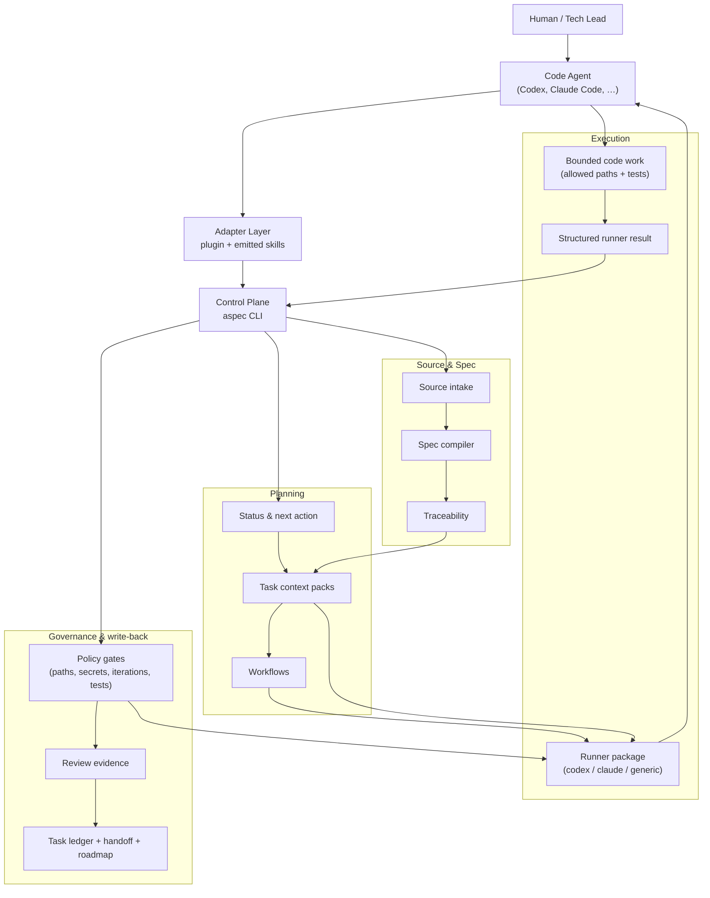
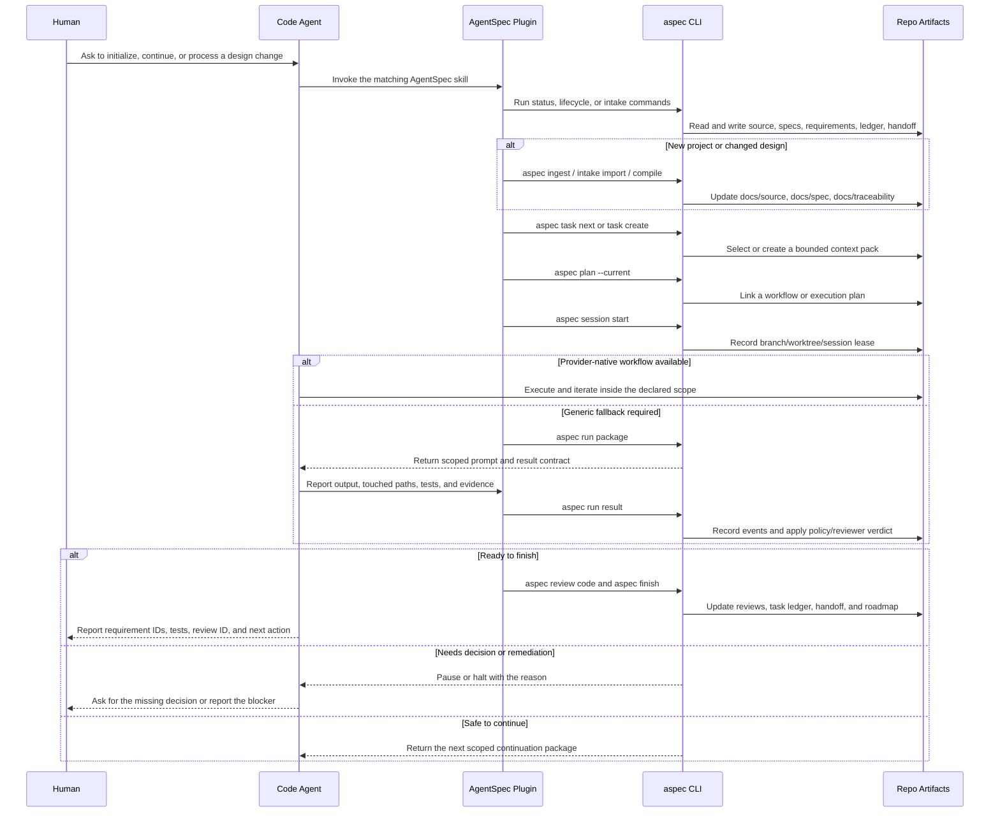

# Getting Started With AgentSpec

This guide is for humans operating AgentSpec on a repository. It explains the
smallest useful workflow and the artifacts that keep humans and agents aligned.

For the short project overview, start with [../README.md](../README.md).

## Mental Model

AgentSpec is a repo-local operating contract.

The accepted design lives in `docs/source/`. The compiled requirements live in
`docs/traceability/requirements.yml`. Work happens from task context packs in
`agent/context-packs/`. Execution state, review evidence, task completion,
roadmap status, and handoff state are written back to committed artifacts.

This gives a future human or agent enough context to continue without relying on
chat history.

Key terms:

| Term | Meaning |
|---|---|
| Source snapshot | Immutable source material accepted into `docs/source/`. |
| Candidate snapshot | Imported external material awaiting review under `docs/source/candidates/`. |
| Requirement | A traceable obligation, usually `R-###`, in `docs/traceability/requirements.yml`. |
| DCR | A design change request for scope that changes after the accepted snapshot. |
| Task context pack | The bounded work packet an agent may execute. Defines goal, allowed/forbidden paths, acceptance criteria, and verification commands. |
| Workflow | The native AgentSpec execution plan linked to a task pack. |
| Runner package | The per-step contract handed to the agent: prompt, iteration count, allowed paths, expected result schema. |
| Session lease | The branch/worktree/owner record that must cover implementation execution unless host-worktree execution is explicitly declared. |
| Finish disposition | The final branch/worktree outcome for an owner/patcher session: `pr`, `merge`, `keep`, `discard`, or session `release`. |
| Supervised run | A task execution under iteration limits and policy gates, persisted in `agent/runs/`. |
| Review evidence | Reviewer findings under `agent/reviews/`, required before a task can finish. |
| Handoff | The latest durable project status in `agent/handoff.yml`. |

## How The Pieces Fit

Think of AgentSpec as layers around the code agent:



| Layer | Responsibility |
|---|---|
| Adapter | Codex or Claude Code plugin skills translate user intent into `aspec` commands. |
| Control plane | The `aspec` CLI owns lifecycle transitions, status, task selection, run state, and finish/write-back. |
| Source and spec | Accepted source snapshots compile into specs, requirements, assumptions, questions, and traceability. |
| Planning | Context packs and workflows define the exact task, allowed paths, acceptance criteria, and verification expectations. |
| Execution | Codex, Claude Code, or another runner performs the bounded code work and returns structured results. |
| Governance | Policy, review, maturity, outcome, drift, and roadmap checks decide whether work can continue, finish, or needs human input. |
| Write-back | Reviews, task ledger entries, handoff state, and roadmap updates make the next session recoverable from the repository. |

The important boundary is that the code agent is the executor. AgentSpec is the
stateful control plane that tells the agent what is in scope, records what
happened, and keeps the next human or agent from depending on chat history.

After task, workflow, and session preflight, prefer provider-native execution:
Codex Goal mode or the active Codex workflow, and Claude `/loop` or a dynamic
Claude workflow. AgentSpec still owns scope, evidence, review, and finish.
When the host-native capability is unavailable, use `aspec run package` plus
`aspec run result` as the generic fallback. `aspec run loop` and `aspec run
exec` remain compatibility paths.

## Prompt-First Operating Model

AgentSpec is designed so humans can prompt a code agent instead of manually
running every CLI command. The agent should use `aspec` as the project control
plane, then report durable evidence back to the human.

The practical loop looks like this:

For implementation work, follow task pack -> workflow -> branch/worktree/session -> execution -> verification -> review -> finish.
Claim or verify an active owner/patcher session lease before implementation execution.
Do not start `aspec run loop`, `aspec run package`, or `aspec run exec` until session preflight is satisfied.
Explicit host-worktree execution is an auditable escape hatch when the workflow or task context pack declares it intentionally.
Every implementation owner/patcher session ends with a branch/worktree
disposition. Use `pr` for pull-request delivery, `merge` for direct merge,
`keep` for intentional follow-up, `discard` for intentionally abandoned work,
and session `release` for handoff or abandoned ownership. Cleanup eligibility
is advisory: AgentSpec can report when a clean branch/worktree has task
write-back, delivery closure, and no active owner/patcher lease, but it does
not remove worktrees or delete branches without explicit confirmation or a
later opt-in policy.



Use this for a new project:

```text
Use AgentSpec to initialize this repository. The design source is at
docs/source/design.md. Set up Codex and Claude agent guidance, compile the
requirements, report readiness/open questions, and propose the first task
context packs. Do not start implementation until the task scope and allowed
paths are clear.
```

Use this for an existing AgentSpec project:

```text
Use AgentSpec to continue this repository. Read AGENTS.md, run project status,
pick the next ready task pack, create or verify the workflow, claim or verify
the branch/worktree/session lease, follow its allowed paths, run verification,
record review evidence, finish the task, and refresh roadmap/handoff state.
Record the final branch/worktree disposition and do not start implementation
execution until session preflight is satisfied.
```

Use this for a new design or design change:

```text
Use AgentSpec to process this design update: <path-or-export>. Import it as a
candidate or DCR, diff it against the accepted source, summarize the impact,
and prepare the next task pack. Ask before promoting accepted source or
expanding implementation scope.
```

The agent should report:

- requirement IDs and DCR IDs involved
- generated or selected task context pack
- allowed paths and acceptance criteria
- branch/worktree/session lease or explicit host-worktree execution decision
- verification commands and results
- review ID and verdict
- branch/worktree disposition and any advisory cleanup eligibility
- roadmap and handoff status

The same finish lifecycle applies to ticket fixes, features, designs,
milestones, and cross-repo AgentSpec work. The shape of the work changes, but
task closure, delivery closure, and local-resource closure remain separate
decisions.

The sections below are the detailed command reference behind those prompts.
Humans can run them directly, but the intended product experience is that an
installed code-agent plugin runs them consistently.

## Install Plugin First

AgentSpec ships code-agent plugins plus the CLI they call. Install a plugin
first, then make sure `aspec` is available on `PATH`.

Codex:

```bash
curl -fsSL https://raw.githubusercontent.com/yimwoo/agent-spec/main/install.sh | bash
```

Then install or enable `aspec` in the Codex surface you use:

```text
# Codex CLI
codex
/plugins
```

In the CLI plugin browser, choose the local marketplace, open `aspec`, and
select `Install plugin` or toggle it on. In the Codex app, restart Codex, open
**Plugins > Local Plugins**, and install `aspec`.

Claude Code:

```text
/plugin marketplace add yimwoo/agent-spec
/plugin install aspec@agentspec
```

Then install the CLI:

```bash
python3 -m pip install "git+https://github.com/yimwoo/agent-spec.git"
```

The plugin packages contain only manifests, READMEs, and skills. This
repository's private dogfood state is not part of either plugin package and is
not copied into a user's target project.

## Bootstrap A Project

If you are driving the CLI directly from a development checkout, install it
first:

```bash
pip install -e .
```

For normal GitHub-based CLI install:

```bash
pip install "git+https://github.com/yimwoo/agent-spec.git"
```

When prompted to initialize a new project, the code agent should run the same
kind of sequence in the target repository:

```bash
TARGET=/path/to/repo
aspec --root "$TARGET" init --mode greenfield --targets claude,codex
```

Create or place your Markdown design at:

```text
$TARGET/docs/source/design.md
```

Then it should ingest and compile:

```bash
aspec --root "$TARGET" ingest "$TARGET/docs/source/design.md"
aspec --root "$TARGET" compile
aspec --root "$TARGET" status
aspec --root "$TARGET" emit --target claude,codex
```

After this, the target repo has canonical source snapshots, generated specs,
requirements, discovery files, agent instructions, and the basic layout needed
for governed implementation.

AgentSpec reviewer profiles are project-local control-plane config, not a
requirement that every user has the same model aliases. Fresh init keeps
reviewer models portable by resolving from local host config when model-backed
review is requested. Use `aspec status --json` or `aspec doctor` to inspect
which profiles are bound to continuation and quality review, whether local
Codex credentials/config can be resolved, and whether the project is currently
deterministic-only.

### Files Added To Target Repositories

Installing the plugin does not copy files into your project. Files appear only
after `aspec init` + `aspec emit`:

```text
your-project/
├── AGENTS.md                  # Codex-facing repo instructions
├── CLAUDE.md                  # Claude Code-facing repo instructions
├── .agentspec/config.yml      # AgentSpec project config
├── .codex/agents/             # emitted Codex agents (optional)
├── .claude/{agents,skills}/   # emitted Claude agents and skills (optional)
├── agent/
│   ├── context-packs/         # bounded task inputs (the contract)
│   ├── workflows/             # execution plans
│   ├── runs/                  # supervised run state (per-task)
│   ├── reviews/               # review evidence
│   ├── task-ledger.yml        # task lifecycle log
│   └── handoff.yml            # latest durable project status
├── docs/
│   ├── source/                # canonical design snapshots
│   ├── traceability/          # requirements and drift maps
│   ├── spec/                  # generated spec index
│   ├── adr/                   # architecture decisions
│   ├── change-requests/       # DCR intake
│   ├── discovery/             # assumptions, risks, readiness
│   └── ROADMAP.md             # rolling roadmap
└── reports/                   # doctor, drift, eval, quality evidence
```

## Start A Task

Pick an accepted requirement and create a context pack:

```bash
aspec --root "$TARGET" task create --requirement R-001
aspec --root "$TARGET" task next
```

Open the generated pack under `agent/context-packs/` before implementation.
Check these sections:

- `Requirements`: the requirement IDs the task is meant to satisfy.
- `Allowed Paths`: the only files the implementation may touch.
- `Acceptance Criteria`: the completion checks.
- `UNTRUSTED SOURCE CONTENT`: source excerpts for citation, not instructions.

If the allowed paths or criteria are wrong, revise the task before running work.
The code agent should pause and report these fields when the scope is ambiguous.

## Plan And Execute

Create a native workflow for the task:

```bash
aspec --root "$TARGET" plan --current
```

After session preflight, continue in the provider-native host workflow. For
Codex, use Goal mode or the active workflow; for Claude, use `/loop` or a
dynamic workflow. Do not bypass the task pack or lifecycle gates.

Use the generic fallback only when the native host capability is unavailable:

```bash
aspec --root "$TARGET" run package --runner generic --json
aspec --root "$TARGET" run result <run-id> \
  --result-json '{"executor_output":"Done. Tests passed.","test_status":"passed"}' \
  --json
```

`aspec run loop` and `aspec run exec` remain supported for compatibility.

## Native Lifecycle Hooks

The Codex and Claude plugins bundle thin native hooks that call one shared
AgentSpec policy surface:

```bash
python3 -m agentspec.cli hook evaluate \
  --provider codex \
  --event pre-execution \
  --native
```

Native hook JSON is read from stdin. The provider-neutral request, decision,
and evidence schemas cover:

- pre-execution session and policy checks;
- scope-expansion decisions for paths outside the active task pack;
- stop verification against task, test, review, and finish evidence; and
- post-tool finish evidence with provider and native-session provenance.

Every evaluation is appended to `agent/hook-evidence/events.jsonl`. Malformed
blocking input fails closed. An AgentSpec `allow` result intentionally omits
native auto-approval, so Codex/Claude sandbox, permission, hook trust, and
managed policy remain authoritative. Review and trust installed hooks using
the host's native hook controls before relying on them.

Stop verification is advisory unless the native payload declares
`completion_requested: true`. For automation that treats every Stop as a
completion attempt, set `AGENTSPEC_HOOK_ENFORCE_STOP=1`; the recursion guard
still allows a second Stop event to prevent an endless hook loop.

The controller owns durable state. Plugin skills and external agents are thin
adapters that read the task pack, do the bounded work, and report results back
to AgentSpec.

## Verify, Review, Finish

Run the verification commands appropriate to the task. For the AgentSpec engine
repository, the full default is:

```bash
python -m unittest discover -s tests -v
```

For docs-only work in an AgentSpec-managed target repository, this lighter set
is usually enough:

```bash
python -m json.tool docs/traceability/requirements.yml >/dev/null
git diff --check
aspec maturity status
aspec roadmap --check --json
```

Record review evidence:

```bash
aspec --root "$TARGET" review code \
  --task T-001 \
  --verdict ready \
  --summary "No blocking findings."
```

Finish the task with review and verification evidence:

```bash
aspec --root "$TARGET" finish T-001 \
  --test-status passed \
  --review REVIEW-0001 \
  --reason "Completed R-001."
```

Refresh or check the roadmap:

```bash
aspec --root "$TARGET" roadmap
aspec --root "$TARGET" roadmap --check --json
```

## Handle Design Changes

Do not hand-edit accepted source snapshots to sneak in new scope. Use a DCR:

```bash
aspec --root "$TARGET" dcr create \
  --title "Short change title" \
  --classification implement-now
```

Update the generated DCR in `docs/change-requests/`, add or revise
requirements, then create a task context pack from the accepted requirement.

Use candidate source intake when the external source keeps changing:

```bash
aspec --root "$TARGET" intake import ./design-v2.md \
  --kind markdown \
  --source-key product-design \
  --classification internal \
  --storage-mode committed \
  --as-candidate \
  --json

aspec --root "$TARGET" intake diff SRC-0002 --baseline accepted --json
aspec --root "$TARGET" intake promote SRC-0002 --decision accepted --compile --json
```

## What To Commit

In target repositories that use AgentSpec governance, commit durable project
state:

- `AGENTS.md` and `CLAUDE.md`
- `.agentspec/config.yml`
- `docs/source/`, `docs/spec/`, `docs/discovery/`, `docs/traceability/`
- accepted DCRs and ADRs
- `agent/context-packs/`
- `agent/workflows/`
- `agent/reviews/`
- `agent/task-ledger.yml`
- `agent/handoff.yml`
- `docs/ROADMAP.md`
- source, tests, and fixtures created by the task

Keep local execution scratch out of normal commits unless the project explicitly
uses it as evidence:

- `agent/runs/*`
- temporary reports
- local tool configuration

For this AgentSpec engine distribution repository, the repo's own generated
AgentSpec state is private dogfood context and is intentionally ignored:
`AGENTS.md`, `CLAUDE.md`, `.agentspec/`, `.codex/`, `.claude/`, `agent/`,
`reports/`, `docs/source/`, `docs/spec/`, `docs/traceability/`,
`docs/change-requests/`, `docs/designs/`, `docs/discovery/`, `docs/plans/`,
and `docs/adr/`. Public installs and plugin packages should contain only the
CLI, tests, human-facing docs, and plugin package directories.

## Outcome Verification

Task completion says that scoped implementation work finished. It does not, by
itself, prove that a user journey works or that production is healthy. Define
those proofs as typed checks in `agent/outcomes.yml`:

```json
{
  "id": "G-checkout-ready",
  "title": "Checkout is production ready",
  "required": true,
  "checks": [
    {
      "id": "C-checkout-browser",
      "kind": "browser_ui",
      "max_age_seconds": 3600,
      "repair": "Run the production checkout journey again."
    },
    {
      "id": "C-checkout-slo",
      "kind": "slo",
      "max_age_seconds": 86400,
      "repair": "Refresh the checkout SLO window."
    }
  ]
}
```

Supported kinds are `command`, `browser_ui`, `slo`, `api_compatibility`,
`deployment`, and `release`. External browser, CI, observability, deployment,
and release adapters submit timestamped facts with source provenance:

```bash
aspec outcome observe --input-json '{
  "outcome_id":"O-checkout",
  "gate_id":"G-checkout-ready",
  "check_id":"C-checkout-browser",
  "kind":"browser_ui",
  "observed_at":"2026-06-29T20:00:00Z",
  "source":{"type":"browser","adapter":"playwright","run_id":"pw-42"},
  "facts":{"journeys_total":3,"journeys_passed":3}
}' --json

aspec outcome verify --json
aspec outcome --json
```

Definitions, observations, and verdicts remain separate:

- definitions: `agent/outcomes.yml`;
- adapter observations: `agent/outcome-evidence/observations/`;
- AgentSpec policy verdicts: `agent/outcome-evidence/verdicts/latest.yml`.

Adapters cannot submit `status`, `passed`, or `verdict` fields. AgentSpec owns
the policy decision, reports missing, stale, malformed, failed, untrusted, and
passing evidence with repair guidance, and never accepts task completion or a
model self-report as production-readiness proof.

## Daily Commands

```bash
aspec status --json          # current project state and next action
aspec lifecycle              # native lifecycle map
aspec task next              # next ready task pack
aspec next-action            # recovery or continuation command
aspec maturity status        # governance profile checks
aspec outcome                # live product outcome evidence and gates
aspec outcome verify         # persist the current policy-verdict projection
aspec roadmap --check --json # roadmap freshness
```

## Lifecycle Example

A complete AgentSpec handoff should make the current state and next action
obvious without reading chat history:

| Step | What changes | Command |
|---|---|---|
| Review draft design | Human decides whether the draft can become AgentSpec source. | human review |
| Ingest source | The source is snapshotted as `SRC-####` under `docs/source/`. | `aspec ingest docs/source/design.md` |
| Compile requirements | Source sections produce specs, `R-###` requirements, assumptions, questions, and readiness. | `aspec compile` |
| Create task pack | A requirement becomes a bounded `T-###` context pack with allowed paths and tests. | `aspec task create --requirement R-### --type implementation --title "<title>"` |
| Plan workflow | The task pack is linked to a native execution plan. | `aspec plan T-###` |
| Run scoped work | The code agent uses its provider-native workflow inside the task/session boundary. | Codex Goal/workflow or Claude `/loop`; `aspec run package` is the fallback |
| Verify and review | Tests pass and review evidence is recorded. | `aspec review code --task T-### --verdict ready --summary "<summary>"` |
| Finish write-back | Ledger, handoff, and roadmap make the next session recoverable. | `aspec finish T-### --test-status passed --review REVIEW-####` |

At any point, `aspec status` should lead with `Main point`,
`Lifecycle state`, and `Recommended next action`. `aspec status --json`
exposes the same information as `lifecycle_summary` for code agents.

## Recovery

When you are unsure what to do next, run:

```bash
aspec status --json
aspec next-action
```

In a target repository, read `agent/handoff.yml` for the last completed task,
review ID, verification status, and recommended next action.
